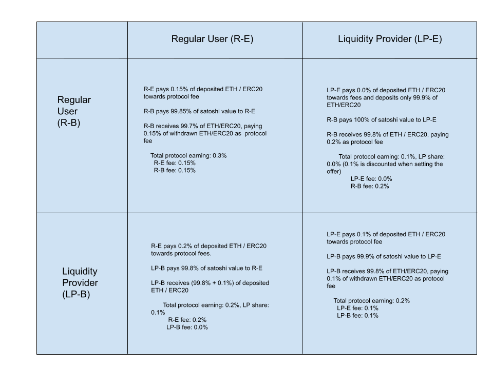

# Table of Contents

- [Abstract](#abstract)
- [Introduction](#introduction)
- [Background](#background)
    - [Hash Time Lock Contracts](#hash-time-lock-contractshtlc)
    - [Simplified Payment Verification](#simplified-payment-verification)
- [Problem Statement](#problem-statement)
- [Solution](#solution-protocol)
- [Technical Details](#technical-details)
    - [Offerbook Contract](#offerbook-contract)
    - [Adding an offer](#adding-an-offer)
    - [Settlement](#settlement)
        - [Sending Bitcoins](#sending-bitcoin)
        - [Initiate Settlement](#initiate-settlement)
        - [Finalize Settlement](#finalize-settlement)
- [Bitcoin Header Chain](#bitcoin-header-chain)
- [Incentivzation](#incentivization)
    - [Bitcoin Light Client](#bitcoin-light-client)
    - [Liquidity Providers](#liquidity-providers)
- [Security](#security)
- [Use cases](#use-cases)
- [Roadmap](#roadmap)
- [Future work](#future-work)
- [Conclusion](#conclusion)

# Abstract

A smart contract based protocol allows trustless exchange of Native Bitcoin to assets on Ethereum and other networks and vice-versa, where the funds on either side would be in control of the users themselves, and not any custodian. While solutions using centralized custodian of funds, and threshold-signature-scheme based custodians offer such an exchange at scale, the main benefit would be lost if the funds were still to be held by a custodian. Custodians have to ensure they are always online, not hacked, and should be trusted by the users. Atomic cross chain swaps offer part of the solution where users can exchange trustlessly in a self-custodial manner. But the main drawback of the atomic swap solution is in the UX. It is not intuitive enough for the users, order discoverability is hard and the users need to be online, monitor the transactions on either chain to complete the swap. In our work, we take smart contract elements from atomic swaps, use an orderbook based exchange on Ethereum, and have Bitcoin light client within Ethereum smart contracts to enable trustless swaps in a self-custodial manner, and with much better user experience - better order discoverability, allowing for fractional swaps, Bitcoin transactions are verified using smart contracts, instead of manually checking the chain and importantly where the funds are in control by the users at all times.
 
# Introduction

Decentralized exchanges have exploded in popularity in recent years and is often beating centralized exchanges in terms of volume. However, it is still not possible to exchange Bitcoin with assets on other chains in a trustless manner. People often resort to centralized exchanges or have to park their funds with a custodian run using threshold-signature-scheme. While these solutions offers better user experience and scalable exchange experience, the main drawback is the centralized nature of such a scheme and users do not have control over their funds at all times. As we have seen several times, centralized exchanges do not maintain full reserves of the user funds, could get hacked and threshold signature scheme based solutions are also based on trust that the participants in the scheme would not collude to steal user funds and the threshold is often limited to a few tens of users. Atomic swaps are a solution to this problem, but the user experience is poor due to issues with peer / order discoverability, fractional swaps are not possible, and users have to be online to complete the swap.

In this work, we propose a non-custodial solution to the problem of enabling trustless swaps from Bitcoin to assets on Ethereum(or other networks), where the funds are always in control by the users and reach the conclusion how our solution offers much better user experience than other trustless swapping solutions like atomic swaps and why this protocol is suitable for trustless swaps involving large orders(eg: OTC markets) compared to having BTC custodied by custodians run by threshold-signature-schemes.

# Background

To enable trustless cross-chain swaps from Bitcoin to Ethereum(extensible to other networks), we use the following core technologies.

## Hash Time Lock Contracts(HTLC)

HTLCs are a staple of cross-chain exchange protocols. Let's say, a user Bob wants to send funds to Alice, but also have the capability to redeem funds if it's not claimed within a time period for various reasons. This can be accomplished by using timelock contract (CheckLockTimeVerify on Bitcoin). Further, Alice should be able to claim the funds only after presenting a pre-image of a hash encoded into the Bitcoin P2WSH script. These two conditions can simultaneously be achieved using HTLC script. The reason for hash lock is to ensure that Alice can only claim funds after Bob has revealed the pre-image of the hash. The timelock makes it possible for Bob to recover funds after a certain time, for whatever reason - for example: Alice backs out of the deal.

## Simplified Payment Verification

Simplified Payment Verification envisioned in the Bitcoin whitepaper is a primary ingredient in providing better user experience in trustless cross-chain swaps. By having a smart contract track Bitcoin block headers, verification of Bitcoin transactions can be done in an automated way by smart contracts executed on ethereum. After making Bitcoin transaction, the user generates a merkle proof of the transaction and submits the proof to the smart contract. The smart contract can verify if the transaction is included in Bitcoin block. This mechanism allows for a better user experience in the cross-chain exchange protocol.

By combining these two technologies, we are able to offer seamless and secure user experience in our cross-chain exchange protocol.

# Problem Statement

Let's say there are two parties Alice and Bob. Alice has ETH on Ethereum, and Bob has Native BTC. Further, Alice and Bob do not know each other nor have a way to discover each other. Both Alice and Bob are unwilling to use centralized exchange to complete the swap nor use an escrow/custodian to park their funds during the swap process. They want to perform the exchange trustlessly.

# Solution (Protocol)

- Step 1: Alice places her ETH locked into a smart contract, along with BTC address where Alice wants to receive BTC.
- Step 2: Bob discovers the smart contract and finds funds in the smart contract that could be obtained by sending BTC.
- Step 3: Bob generates a secret, hashes the secret and generates a HTLC address using Alice's address, along with his own address for recovery after a certain time period.
- Step 4: Bob sends BTC to the HTLC address
- Step 5: Bob waits a few confirmations on BTC block, generates merkle proof of the transaction and submits to the contract
- Step 7: Contract verifies the merkle proof and locks the ETH for 15 minutes
- Step 8: Bob now sends the plaintext secret to the smart contract that Alice can use to unlock funds.
- Step 8: Contract verifies if it's a valid secret and releases the ETH funds to Bob.
- Step 9: Alice can spend funds from BTC address using the secret.


This protocol assumes that the Trustlex contract has access to Bitcoin block headers. Thus, a part of the solution is also to have a separate contract track Bitcoin block headers on Ethereum which is discussed in the [Bitcoin Header Chain](#bitcoin-header-chain) section.

# Technical Details

## OfferBook contract

An offer book contract holds all the available offers. 

## Adding an Offer

Adding an offer is a simple process. Users decide how much ETH(or ERC20) they want to sell and at what price. User also has to specify a 20-byte `pubKeyHash` that will be used to spend the received Bitcoins along with an offerValidFor

```
  addOffer(
        uint256 offerValue, // Amount of ETH or ERC20 
        uint64 satoshisToReceive, // Amount of BTC to receive
        bytes20 pubKeyHash, // PubKey Hash used to spend Received BTC
        uint32 offerValidFor // Offer validity
    )
```

Recommendation:
- A user can use a HD wallet to generate pubKeyHash.

## Settlement

Settlement is a multi step process:

- Select a suitable offer
- Generate HTLC Bitcoin address
- Send BTC to that address
- Wait for required confirmations
- Generate the merkle proof and perform 1) Initialize Settlement with transaction proof, and hashedSecret and 2) Finalize Settlement revealing the secret

### Sending Bitcoin

#### Generating short order id

1. Generate an Order Id 
```
   keccak256(concat(
     <20-byte-contract-address> <offer-id-from-contract> <settler-ethereum-address> <pub-key-hash> <order-timestamp>
   ));
```

2. Generate short order id
```
   shortOrderId = first 4 bytes of order id
```

#### Generating Bitcoin Address

Bitcoin address is derived based on the following attributes:
- *pubKeyHash*:  The counterparty's pubKeyHash set along with the offer
- *secret*: A random 32-byte secret is generated and a hashed secret is generated using Bitcoin's `hash256` - double sha256
- *lockTime*: Lock time should be set to offerExpiryTime + 2 days (in seconds)
- *selfPubKeyHash* - PubKeyHash that will be used by sender of BTC to recover funds in cases where either the user or the counterparty changes their mind regarding the offer.

The following script is used to generate a P2WSH Bitcoin Address

```
  04 <4-byte-short-order-id>  
  OP_DROP 
  OP_DUP 
  OP_HASH160 
  <20-bytepubKeyHash>  //  pubKeyHash from the offer
  OP_EQUAL
  OP_IF
     OP_SWAP
     OP_HASH256
     <hashedSecret>    // generate a secret and compute hash256(secret) to get hashedSecret
     OP_EQUALVERIFY
  OP_ELSE
    <locktime>   // Lock time should be offerExpiryTime(in seconds) + 2 days(in seconds)
    <OP_CHECKLOCKTIMEVERIFY>
    <OP_DROP>
    <OP_DUP> 
    <OP_HASH160>
    <self-pubkey-hash> // Recovery pub key hash
    OP_EQUALVERIFY,
  OP_ENDIF,
  OP_CHECKSIG, 
```

Recommendation:
- A user can use a HD wallet to generate selfPubKeyHash at the time of settlement to make the process more secure.

#### Making a Bitcoin Transaction

Once a P2WSH address is generated, any standard wallets can be used to send BTC to that address.

### Initiate Settlement

Before initiating settlement, a user has to wait for the required number of confirmations (usually 6). The required number of confirmations can be queried from the contract.

- User generates the merkle proof of the Bitcoin transaction
- Submits `initiateSettlement` request to the offer book contract.

```
   function initiateSettlement(
        uint256 offerId,
        SettlementRequest calldata _settlement, // Settlement details containing hashedSecret, lockTime, pubKeyHash, and additional details like amount requested.
        PaymentProof calldata proof // Merkle proof of payment
    )
```

The contract locks the requested amount of ETH / ERC20 from the offer for 15 minutes before `finalizeSettlement` is called.

### Finalize Settlement

During `finalizeSettlement`, the secret is revealed, using which the user placing the offer can spend the Bitcoin received.  The contract verifies if the `hashedSecret` passed during `initiateSettlement` matches with the `hash256(`secret`)` before releasing the funds.

The reason to have the settlement process as two step process is to ensure security of the transaction. During the 15 minutes lock window, the following cannot happen
- Offer cannot be canceled by the user offering ETH.
- Any other user is unable initiateSettlement for the selected amount of ETH / ERC20.

```
  function finalizeSettlement(
        uint256 offerId,
        HTLCSecret calldata htlcSecret
    )
```

# Bitcoin Header Chain

A smart contract on Ethereum is initialized that keeps track of Bitcoin block headers. Instead of tracking all Bitcoin block headers, the contract would be initialized to start tracking Bitcoin block header at a recent height.

```
   constructor(bytes memory initialConfirmedBlockHeader, uint32 height, uint32 _initialEpochTime) {
       // parse header bytes and store the header data.
       // _initialEpochTime - will be used to compute the next proof of work target at the end of current epoch(2 weeks).
   }
```

The contract has a function to submit block headers. This function can be used by anyone to augment the chain by posting the next Bitcoin block header that will be validated by the smart contract.

```
   function submitBlock(bytes calldata blockHeader) external {
       // validate block header
       // store merkle root, block hash, block height, timestamp(to calculate proof of work epoch)
   }
```

The contract also has a function to verify transaction inclusion proof that can be used by the applications to verify if a Bitcoin transaction was included in a block or not.

```
   function verifyTxInclusionProof(bytes32 txId, uint32 blockHeight, uint256 index, bytes calldata hashes) external view returns (bool result) {
     // Verifies txId is available in block at height blockHeight and the proof comprise the index and merklepath (hashes).
   }
```

# Incentivization

## Bitcoin Light Client

While the exchange usecase doesn't require any incentive as the incentive to use the platform is to trustlessly perform the exchange. The exchange process assumes the availability of Bitcoin light client with updated Bitcoin block headers. To incentivse anyone to post Bitcoin block headers to smart contracts, the contract initially offers '42' TLX tokens, reducing by half every month, until the incentive reaches 0.01 TLX tokens. At which point, the incentive remains constant at 0.01 TLX tokens for every block submitted.

TLX tokens are used in the following scenario:
- Users can burn their TLX tokens to redeem any fees collected by the offer book contracts.
- Use the TLX tokens to vote on governance proposals 
    * To create new Offer book contracts
    * To resolve any unresolved forks in Bitcoin header chain contracts

This mechanism ensures, the Bitcoin light client is maintained by a community of participants.

## Liquidity Providers

Liquidity Providers play a vital role in any exchange ecosystem and decentralized exchanges are no exception. There are no Liquidity Pools for Bitcoin offered by the protocol, however, users are free to provide liquidity on their own, and custody their own funds.

The protocol identifies liquidity providers by the frequency of their trades. Initially the protocol identifies a user as a liquidity provider if they have completed 1 trade in a day.

Here is a summary on how fee is distributed between the protocol and LP providers:


   
# Security

## Security of Funds

In the protocol discussed, funds are always held by private keys of the owners. There are no centralized entities or multisig holding the funds.

On the Bitcoin side: Funds are locked in HTLC contract and can be withdrawn at the conclusion of the protocol.
On Ethereum side: Funds are locked in Smart contract and can be withdrawn at anytime or at the conclusion of the protocol.

## Security of Cryptographic operations

There are no new cryptographic operations developed or used. We are using standard cryptographic libraries and standard cryptographic operations to enable a trustless cross chain swaps.

## Bitcoin Script

We have independently ensured the Custom Bitcoin script that we have developed to enable the exchange protocol is secure and cannot result in losing coins.

## Smart Contract security

We have implemented tests to ensure funds are accessible and not locked by smart contract. We plan to undergo an external Audit to ensure the smart contract is secure.

# Use cases

While the usecase we have presented is for trustless exchange of ETH or ERC20 tokens with Bitcoin, the Bitcoin light client infrastructure can also be used by the following applications:
1. Trustless wbtc to native BTC conversion.
2. Trustless OTC exchange markets between Bitcoin and assets on Ethereum network.
3. Use Native Bitcoin to purchase NFT on Ethereum without intermediaries or intermediary tokens.
4. Use Native Bitcoin to purchase tokenized Real world Assets on Ethereum (and other networks).
5. Lending protocol on Ethereum (or EVM supported networks) with Native Bitcoin as collateral. This require a custodian backed by threshold signature scheme to hold funds.
6. Stablecoin protocol with Native Bitcoin as collateral. This requires a custodian backed by threshold signature scheme to hold funds.

# Roadmap
1. Launch Trustlex Offer Book to enable Native BTC <=> ETH conversion using centralized Bitcoin Header Chain oracle (August 2023)
2. Launch Trustlex Offer Book to enable Native BTC <=> WBTC conversion using centralized Bitcoin header Chain oracle (August 2023)
3. Launch Incentivized Bitcoin Header Chain and create new offer book contracts for various pairs. (September 2023)
4. Launch Incentivized Bitcoin Header chain on other platforms supporting EVM (Avalanche, Arbitrum, Tezos) (September 2023 onwards)
5. Launch Incentivized Bitcoin Header and exchange contracts on Non-EVM platforms (Near, Solana, Tezos mainnet) (January 2024)
6. Launch lending application with Bitcoin as collateral by custodying Bitcoin using Threshold Signature Scheme (January 2024)

# Future work
1. Evaluate and Integrate Decentralized ID solutions to comply with local regulations (eg: MiCA).

# Conclusion

We have presented how the Trustlex exchange protocol works, the variations to the existing technologies like HTLC, Atomic Swap, BTCRelay that we have developed to enable such a protocol enabling better user experience for self-custodial exchange between Bitcoin and assets in the Ethereum network.